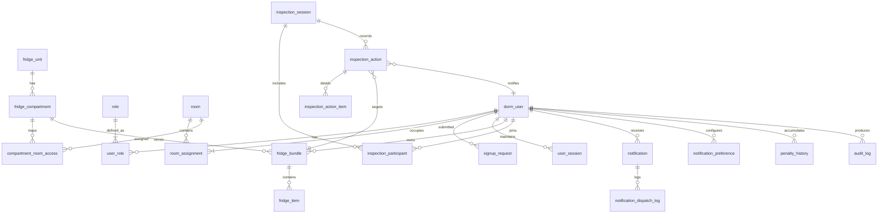

# DormMate 데이터 모델 (MVP 초안)
*대상: Iteration 1~3 (AUTH-01 / FRIDGE-02 / NOTI-01)*

## 1. 범위 및 설계 원칙
- 계정·권한, 냉장고 포장, 검사/알림 모듈을 MVP 범위로 한정한다. Phase 2(세탁실·도서관 등)는 관계만 참고 항목으로 남긴다.
- 문서가 소스 오브 트루스가 되도록, 모든 엔터티는 `docs/feature-inventory.md`와 `nogitReadME.md`에 정의된 정책을 근거로 정리한다.
- 확장 가능성을 위해 식별자는 기본적으로 UUID를 사용하며, 호실·스티커 번호 등 도메인 키는 별도 컬럼으로 유지한다.
- 소프트 삭제가 필요한 객체(포장, 물품, 알림 등)는 `status` 또는 `deleted_at` 컬럼으로 표현한다.
- 외부 메신저(Band 톡)와 연계된 메모는 보관하지 않으며, 승인/반려 기록은 시스템 내부 테이블에서만 추적한다.
- 포장 라벨 코드는 칸별로 001~999 범위를 사용하고, 삭제된 포장은 시퀀스를 통해 재사용한다.

> **현재 진행 상태 요약 (2025-10-25 기준)**  
> | 모듈 | 11/02 데모 | 11/11 확장 | 11/12 이후 |
> | --- | --- | --- | --- |
> | 인증/세션 | 로그인/세션 유지 | (후속) 가입/승인/탈퇴/재설정 | 벌점·감사, Phase2 연계 |
> | 냉장고 | 포장 CRUD, 기본 용량 | 임박/만료·검색, 다중 검사(여력 시 SSE) | 증설/통계/강제 수정 |
> | 검사·알림 | 단일 검사·즉시 알림 | 2인 합류, 알림 배치/설정 | dedupe/TTL/정책 UI |
> | 관리자 | 검사/알림 로그 조회 | 현황·통계 API, 알림 정책 UI | CSV/대시보드, 운영 도구 |

## 2. 모듈별 핵심 엔터티 개요
| 모듈 | 엔터티 | 핵심 목적 |
| --- | --- | --- |
| 계정/권한 | `dorm_user`, `room`, `room_assignment`, `signup_request`, `role`, `user_role`, `user_session` | 가입 승인 흐름, 호실 배정 이력, 역할 기반 접근 제어, 세션 관리 |
| 냉장고 | `fridge_unit`, `fridge_compartment`, `compartment_room_access`, `fridge_bundle`, `fridge_item`, `bundle_label_sequence` | 냉장고 리소스 구성, 호실-칸 매핑, 포장/물품 등록 및 용량 제어 |
| 검사 | `inspection_session`, `inspection_participant`, `inspection_action`, `inspection_action_item` | 층별장 검사 세션 동시성, 조치 기록, 미등록 물품 폐기(실시간 SSE 동기화는 확장 과제) |
| 알림 | `notification`, `notification_preference`, `notification_dispatch_log` | 하단 탭 배지/푸시 알림 저장, 사용자별 알림 설정, 실패 로그 보존 |
| 공통 로그 | `audit_log`, `penalty_history`(참고) | 사용자 행동 감사, 벌점 연계 (Iteration3 이후 연동을 고려하여 placeholder로 정의) |

## 3. 관계 개요

## 4. 엔터티 상세

### 4.1 계정 및 권한
DormMate의 거주자는 호실과 개인 번호를 기반으로 가입 요청을 제출하고, 관리자가 이를 승인하거나 반려한다. 승인되면 즉시 `dorm_user` 레코드가 활성화되어 역할 매핑과 세션 관리가 가능해지고, 반려 시에는 사유를 포함한 결괏값을 `signup_request`에 남겨 추후 감사에 참고한다. Band 톡으로 전달하던 추가 메모는 시스템에 보관하지 않는다.

| 엔터티               | 주요 필드                                                                                                                                                              | 설명 및 정책 근거                                                                                                            |
| ----------------- | ------------------------------------------------------------------------------------------------------------------------------------------------------------------ | --------------------------------------------------------------------------------------------------------------------- |
| `dorm_user`       | `id`, `login_id`(unique, lower-case), `password_hash`, `full_name`, `email`, `status`(`PENDING`/`ACTIVE`/`INACTIVE`), `created_at`, `updated_at`, `deactivated_at` | 가입 승인 전까지 `PENDING` 상태 유지(`docs/feature-inventory.md:29`), 탈퇴 시 `INACTIVE` 처리 후 이력 보존(`docs/feature-inventory.md:44`) |
| `signup_request`  | `id`, `room_id`, `personal_no`, `login_id`, `email`, `submitted_at`, `status`, `reviewed_by`, `reviewed_at`, `decision_note`                                       | 승인 또는 반려 이력을 저장하고, 관리자가 입력한 사유는 `decision_note`로 보관한다(`docs/feature-inventory.md:31`)                                 |
| `room`            | `id`, `floor`, `room_number`, `room_type`(`SINGLE`/`TRIPLE`), `capacity`                                                                                           | 호실 메타데이터. 1인실/3인실 구성(`nogitReadME.md:9`)                                                                              |
| `room_assignment` | `id`, `room_id`, `dorm_user_id`, `personal_no`, `assigned_at`, `released_at`                                                                                       | 호실 배정 이력 및 중도 퇴사 처리. `released_at`이 NULL이면 현 입주자(`nogitReadME.md:18`)                                                 |
| `role`            | `code`, `name`, `description`                                                                                                                                      | `RESIDENT`, `FLOOR_MANAGER`, `ADMIN` 기본 제공                                                                            |
| `user_role`       | `dorm_user_id`, `role_code`, `granted_at`, `granted_by`, `revoked_at`                                                                                              | 층별장 임명/해제 즉시 반영(`docs/feature-inventory.md:118`)                                                                      |
| `user_session`    | `id`, `dorm_user_id`, `refresh_token`, `expires_at`, `created_at`, `revoked_at`, `revoked_reason`                                                                  | 7일 세션 유지 및 비밀번호 변경 시 세션 무효화(`docs/feature-inventory.md:37`)                                                           |

#### 운영 정책 메모
- **층 구성**: 2층은 남성, 3~5층은 여성 전용으로 운영하며 각 층에는 201~224 형태의 24개 호실이 존재한다.  
- **호실 유형**: 기본은 3인실(`TRIPLE`, `capacity=3`, `personal_no` 1~3)이며, 각 층의 지정 호실은 1인실(`SINGLE`, `capacity=1`, `personal_no=1` 고정)로 운영한다.
- 1인실 고정(  
  - 2층: 213호, 224호  
  - 3층: 313호  
  - 4층: 413호  
  - 5층: 513호)
- 1인실 고정호실을 제외한 나머지호실은 모두 3인실이다.
- **식별 규칙**: `room_number-personal_no` 조합(예: `201-1`)으로 거주자를 식별하며, 거주 기간은 최대 1년, 중도 퇴사가 가능하다.

### 4.2 냉장고 리소스 및 포장
각 층의 냉장고와 칸은 `slot_index` 순번으로 식별하며, 사용자에게는 UI에서 해당 순번을 문자(예: A, B, C)로 변환해 노출한다. 포장(FridgeBundle)은 칸마다 001~999 범위의 3자리 번호를 순차적으로 부여받고, 삭제된 포장은 번호를 재사용할 수 있도록 칸별 라벨 시퀀스를 유지한다. 칸 허용량(`max_bundle_count`)은 라벨 범위 이하에서 기본값을 설정하고, 필요 시 관리자가 직접 조정한다. 검사는 칸 단위 잠금(`is_locked`, `locked_until`)으로 진행되며, 검사 이후 수정된 물품 여부를 추적해 조치 통계를 보존한다.

| 엔터티 | 주요 필드 | 설명 및 정책 근거 |
| --- | --- | --- |
| `fridge_unit` | `id`, `floor_no`, `display_name`, `status`(`ACTIVE`/`SUSPENDED`/`REPORTED`/`RETIRED`), `retired_at`, `created_at`, `updated_at` | 층별 냉장고 자원 상태를 공통 ENUM으로 관리한다. 확장·철거·신고 대응(`docs/feature-inventory.md:96`) |
| `fridge_compartment` | `id`, `fridge_unit_id`, `slot_index`, `compartment_type`, `status`(`ACTIVE`/`SUSPENDED`/`REPORTED`/`RETIRED`), `max_bundle_count`, `is_locked`, `locked_until`, `created_at`, `updated_at` | 칸 순번과 상태를 관리한다. `max_bundle_count` 기본값은 라벨 범위(001~999)이며, 관리자 조정 가능(`docs/feature-inventory.md:40`) |
| `compartment_room_access` | `id`, `fridge_compartment_id`, `room_id`, `assigned_at`, `released_at`, `created_at` | 칸-호실 배정 이력을 저장하고 현재 배정 여부를 판별한다(`docs/feature-inventory.md:47`, `nogitReadME.md:31`) |
| `bundle_label_sequence` | `fridge_compartment_id`, `next_number`, `recycled_numbers`, `updated_at` | 칸별 스티커 번호 발급/재사용을 관리한다(`docs/feature-inventory.md:40`) |
| `fridge_bundle` | `id`, `owner_user_id`, `fridge_compartment_id`, `label_number`, `bundle_name`, `memo`, `status`(`ACTIVE`/`DELETED`), `created_at`, `updated_at`, `deleted_at` | 칸별 3자리 번호만 저장하고 UI가 문자+번호 라벨을 조합한다(`docs/feature-inventory.md:73`) |
| `fridge_item` | `id`, `fridge_bundle_id`, `item_name`, `quantity`, `unit_code`, `expiry_date`, `status`(`ACTIVE`/`DELETED`), `last_inspected_at`, `created_at`, `updated_at`, `deleted_at` | 소프트 삭제 및 마지막 검사 시점을 추적한다. 검사 이후 수정 여부는 `updated_at` 비교로 파생(`docs/feature-inventory.md:48`) |
| `unregistered_item_event` | `id`, `inspection_session_id`, `reported_by`, `approx_room_id`, `item_description`, `disposed_at` | 미등록 물품 간편 등록 후 즉시 폐기 기록(`docs/feature-inventory.md:82`) |

#### 운영 정책 메모
- **냉장고 배치**: 2~5층 각각 1대(기본), 냉장 칸 3개 + 냉동 칸 1개 구성. 추가 증설 시 `fridge_unit`를 추가하고 칸 수에 따라 호실 배분을 재계산한다.  
- **호실 배분 규칙**: 냉장 칸 수에 따라 `compartment_room_access`를 재계산한다. 기본 구성(냉장 3칸·냉동 1칸)에서는 접근 권한을 위해 냉장 칸마다 8호실씩, 냉동 칸은 24호실 전체를 공용으로 매핑한다. 칸의 실제 포장 허용량은 `fridge_compartment.max_bundle_count`(기본적으로 라벨 범위 001~999에 맞춰 설정)로 관리한다  .
- **초기 시드 기준**: `V6__seed_fridge_sample_data.sql`에서는 운영상 제한을 위해 냉장 칸 `max_bundle_count`를 8, 냉동 칸을 24로 초기화하지만, 이는 정책 변경 시 자유롭게 상향 조정할 수 있다.
  - 기본 슬롯 예: `slot_index` 0(01~08호), 1(09~16호), 2(17~24호), 3(냉동, 전체 24호).  
  - 냉장고가 층당 2대로 늘어나고 냉장 칸이 6개가 되면 호실 당 4개씩 균등 분배한다.  
- **층별장**: `user_role`에 `FLOOR_MANAGER`를 부여하며, 동일 칸 검사 시 최대 2명이 `inspection_session`을 공유해 참여한다.

### 4.3 검사 세션 및 조치
층별장은 칸 단위로 검사 세션을 생성해 최대 두 명이 동시에 점검할 수 있다. 세션이 열리는 동안 해당 칸은 잠금 상태로 유지되며, 모든 포장에 대한 조치 내역이 `inspection_action`을 통해 기록된다. 경고·폐기 결정과 자유 메모는 거주자 알림 및 통계에 그대로 활용된다.

| 엔터티 | 주요 필드 | 설명 및 정책 근거 |
| --- | --- | --- |
| `inspection_session` | `id`, `fridge_compartment_id`, `started_at`, `ended_at`, `status`(`IN_PROGRESS`/`SUBMITTED`/`CANCELLED`), `submitted_by`, `submitted_at`, `total_bundle_count` | 검사 세션 생성 시 칸 잠금, 제출 시 조치 요약 저장(`docs/feature-inventory.md:101`) |
| `inspection_participant` | `inspection_session_id`, `dorm_user_id`, `role`(`LEAD`/`ASSIST`), `joined_at`, `left_at` | 최대 2명 동시 검사. SSE 기반 실시간 동기화는 향후 확장 시 활용하며, **MVP에서는 단독 검사 플로우**를 기본으로 한다(`docs/feature-inventory.md:94`) |
| `inspection_action` | `id`, `inspection_session_id`, `fridge_bundle_id`(nullable), `target_user_id`, `action_type`(`WARN_INFO_MISMATCH`/`WARN_STORAGE_POOR`/`DISPOSE_EXPIRED`/`PASS`/`UNREGISTERED_DISPOSE`), `reason_code`(nullable), `free_note`, `recorded_at`, `recorded_by` | 경고/폐기/통과 기록 및 자유 메모(`docs/feature-inventory.md:103`). `UNREGISTERED_DISPOSE` 시 미등록 물품명을 `free_note`에 포함하며, 기타 사유는 `reason_code`를 비워두고 자유 메모에 기록한다 |
| `inspection_action_item` | `id`, `inspection_action_id`, `fridge_item_id`(nullable), `snapshot_name`, `snapshot_expires_on`, `quantity_at_action` | 조치 시점의 물품 정보를 보존해 통계와 분쟁 대응을 지원 |

#### 검사 사유 코드 (확정)
| 코드 | 적용 액션 | 설명 | 통계/벌점 처리 |
| --- | --- | --- | --- |
| `WARN_INFO_MISMATCH` | 경고 | 스티커 정보와 실제 물품이 일치하지 않음 | 경고 통계에 포함, 벌점 없음 |
| `WARN_STORAGE_POOR` | 경고 | 포장 훼손, 냄새 등 보관 불량 | 경고 통계에 포함, 벌점 없음 |
| `DISPOSE_EXPIRED` | 폐기 | 유통기한 경과 물품 폐기 | 폐기 통계에 포함, 벌점 1점(`penalty_history`) 부여 |
| `UNREGISTERED_DISPOSE` | 미등록 폐기 | 스티커가 없는 미등록 물품 폐기 | 미등록 폐기 통계에 포함, 벌점 없음 |

코드로 표현하기 어려운 특수 상황은 `reason_code`를 비워두고 `free_note`에만 기록한다.

### 4.4 알림 및 설정
알림은 하단 탭 배지와 PWA 푸시 모두에서 동일한 `notification` 레코드를 공유하며, `dedupe_key`와 `ttl_at` 정책으로 중복 발송을 방지한다. 사용자는 kind별 수신 여부와 백그라운드 허용 여부를 직접 제어하고, 실패한 발송 로그는 장애 분석을 위해 별도로 보관한다.

| 엔터티 | 주요 필드 | 설명 및 정책 근거 |
| --- | --- | --- |
| `notification` | `id`, `user_id`, `kind_code`, `title`, `body`, `state`(`UNREAD`/`READ`/`EXPIRED`), `dedupe_key`, `ttl_at`, `metadata`(JSON), `created_at`, `read_at`, `expired_at` | 하단 탭 배지·푸시 알림 저장, dedupe/TTL 정책 반영(`docs/feature-inventory.md:152`). MVP에서는 kind별 기본 TTL을 코드 상수로 정의하고, `ttl_at`에 보존 시점을 명시해 향후 설정 파일로 이전한다 |
| `notification_preference` | `user_id`, `kind_code`, `is_enabled`, `allow_background`, `updated_at` | 알림 종류별 ON/OFF 및 백그라운드 수신 설정(`docs/feature-inventory.md:55`, `docs/feature-inventory.md:142`) |
| `notification_dispatch_log` | `id`, `notification_id`, `channel`, `status`(`SUCCESS`/`FAILED`), `error_code`, `error_message`, `logged_at` | 실패 로그만 저장(`docs/feature-inventory.md:56`) |

#### 알림 TTL 외부 설정 전략
1. **기본값**: 코드 내 `NotificationKind` Enum에 kind별 기본 TTL(시간)을 정의한다.
2. **환경/설정 파일 오버라이드**: `application.yml`의 `notification.ttl-defaults` 맵에서 kind별 TTL을 재정의할 수 있게 한다. 배포 전 정책 변경은 이 값을 수정해 반영한다.
3. **운영 중 오버라이드**: *(확장 과제)* `notification_policy` 테이블을 별도 PR로 도입해 런타임 TTL을 저장한다. MVP에서는 코드 상수와 설정 파일만 사용한다.
4. **캐시 & 재계산**: TTL 변경 시 `notification` 레코드가 생성될 때 적용되는 `ttl_at`만 영향을 받으므로, 기존 레코드는 그대로 보존하고 새로운 알림부터 변경된 TTL을 사용한다.

### 4.5 공통 로그 및 벌점 (미니멀 스켈레톤)

| 엔터티 | 주요 필드 | 설명 및 정책 근거 |
| --- | --- | --- |
| `audit_log` | `id`, `actor_user_id`, `action`, `resource_type`, `resource_id`, `metadata`, `created_at` | `DormUser` 계정 관련 로그인·잠금/해제, 냉장고 조치, 알림 설정 등 민감 이벤트를 추적(`docs/ops/security-checklist.md:12`). `actor_user_id`는 시스템 이벤트 시 NULL 허용 |
| `penalty_history` | `id`, `user_id`, `source`(`FRIDGE_INSPECTION`/`LAUNDRY`/`MULTIPURPOSE`/`LIBRARY`), `points`, `reason`, `issued_at`, `expired_at`, `issuer_id` | 벌점이 일정 기준을 넘었을 때 알림 발송과 모듈 제한을 구현하기 위한 기반(`docs/feature-inventory.md:125`). 냉장고 검사의 경우 경고=0점, 폐기=1점으로 누적한다 |

## 5. Feature Inventory TODO 싱크 체크리스트
- [x] 가입 승인/반려 로그(승인자·사유·시간) 보존 (`signup_request.status`, `reviewed_by`, `reviewed_at`, `decision_note`) – `docs/feature-inventory.md:31`
- [x] 세션 7일 유지·비밀번호 변경 시 무효화 구조 (`user_session`) – `docs/feature-inventory.md:37`
- [x] 칸-호실 매핑 정합성 검증용 테이블 (`compartment_room_access`) – `docs/feature-inventory.md:50`
- [x] 알림 설정/실패 로그 저장 (`notification_preference`, `notification_dispatch_log`) – `docs/feature-inventory.md:55-56`
- [x] 검사 세션 잠금·조치 기록·알림 발송 대상 추적 (`inspection_session`, `inspection_action`) – `docs/feature-inventory.md:94-110`
- [x] 미등록 물품 간편 등록 후 폐기 기록 (`unregistered_item_event`) – `docs/feature-inventory.md:82`
- [x] 유통기한 임박/만료 배치 dedupe 키 적용 (`notification.dedupe_key`) – `docs/feature-inventory.md:152`

## 6. 결정된 정책 및 향후 과제
- **칸 용량 규칙**: 각 칸이 허용할 포장 수(`max_bundle_count`)는 기본적으로 라벨 범위(001~999) 내 값으로 설정하며, 운영 정책에 따라 개별 칸만 수동 조정할 수 있다.
- **물품 수량 단위**: `fridge_item.quantity`는 “개” 단위 정수로만 관리한다.
- **검사 사유 관리**: `action_type`은 `WARN_INFO_MISMATCH`, `WARN_STORAGE_POOR`, `DISPOSE_EXPIRED`, `PASS`, `UNREGISTERED_DISPOSE` 중 하나이며, 특수 상황은 `reason_code`를 비워두고 `free_note`로만 처리한다.
- **알림 TTL 정책**: 기본 값은 코드 Enum에 정의하고, 필요 시 `application.yml` 값으로 오버라이드한다. `notification_policy` 테이블은 확장 시 도입하고, `notification.ttl_at`에는 최종 적용된 보존 시점을 저장한다.
- **벌점 연동**: 냉장고 검사 결과는 경고=0점, 폐기=1점으로 `penalty_history`에 누적한다.
- **감사 로그 범위**: MVP에서는 인증, 포장, 검사, 알림 설정 변경 등 정책 민감도가 높은 작업만 기록한다.

향후 과제:
- 자동 산출된 `max_bundle_count`를 UI/관리 도구에서 조정할 수 있는 관리 화면을 마련한다.
- 검사 사유 Enum 도입 시 코드 값 리스트와 통계 연계 로직을 정의한다.
- `notification_policy` 테이블 및 관리자 화면은 알림 정책 고도화 단계에서 도입한다.
