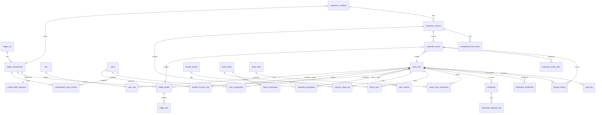

# DormMate 데이터 모델
*용도: MVP 범위(AUTH/FRIDGE/INSPECTION/NOTIFICATION/ADMIN)의 엔터티 구조와 관계를 정의하는 데이터 소스 오브 트루스. 스키마·마이그레이션·API 타입을 설계하거나 검증할 때 참조한다.*

## 1. 범위 및 설계 원칙
- 기준 문서: `docs/1.Feature_Inventory.md`(정책/용어), `docs/2.Demo_Scenario.md`·`docs/2.1.Demo_Plan.md`(흐름/체크리스트), `docs/2.2.Status_Board.md`(진행 로그). 구체 필드는 Flyway 마이그레이션(`backend/src/main/resources/db/migration`)과 도메인 엔터티(`backend/src/main/java/com/dormmate/backend/modules/**/domain`)를 따른다.
- 식별자는 기본적으로 UUID를 사용하고, 호실 번호·스티커 번호 등 도메인 키는 별도 컬럼으로 유지한다.
- 소프트 삭제는 `status` + `deleted_at` 또는 만료 시각(`ttl_at` 등)으로 표현한다.
- 칸/검사 잠금, 알림 TTL, 벌점 정책 등 운영 파라미터는 `admin_policy`와 서비스 상수를 기준으로 관리한다.

## 2. 모듈별 핵심 엔터티 개요
| 모듈 | 엔터티 | 목적 |
| --- | --- | --- |
| 계정/권한 | `dorm_user`, `resident_account_slot`, `room`, `room_assignment`, `role`, `user_role`, `user_session`, `admin_policy` | 사용자/호실 슬롯/역할/세션 관리, 운영 정책(알림/벌점/배치 시각) 저장 |
| 냉장고 | `fridge_unit`, `fridge_compartment`, `compartment_room_access`, `bundle_label_sequence`, `fridge_bundle`, `fridge_item` | 층별 냉장고/칸 자원, 호실-칸 배정, 포장/물품 등록·라벨 재사용 |
| 검사·일정·벌점 | `inspection_session`, `inspection_participant`, `inspection_action`, `inspection_action_item`, `inspection_schedule`, `unregistered_item_event`, `penalty_history` | 칸 잠금이 걸린 검사 세션, 조치·스냅샷·미등록 물품 기록, 일정 관리, 벌점 누적 |
| 세 시설 (확장) | `laundry_device`, `laundry_usage_log`, `laundry_message`, `laundry_maintenance_report`, `library_book`, `library_loan`, `library_reservation`, `study_room`, `study_room_reservation`, `study_room_report` | 세탁실 23대 기기/메시지, 도서관 대출/대기열, 다목적실 주간 타임라인/노쇼 관리 (상세: `docs/facility-contracts.md`) |
| 알림 | `notification`, `notification_preference`, `notification_dispatch_log` | 알림 저장/TTL/dedupe, 사용자별 선호 설정, 발송 실패 로그 |
| 감사 | `audit_log` | 민감 행위(검사 제출/정정, 시드 실행, 재배분, 슬롯 입/퇴사 등) 추적 |

## 3. 관계 개요

```mermaid
erDiagram
    dorm_user ||--o{ user_role : has
    role ||--|{ user_role : defines
    room ||--o{ resident_account_slot : allocates
    dorm_user ||--|| resident_account_slot : occupies_current
    dorm_user ||--o{ room_assignment : history
    room ||--o{ room_assignment : contains
    dorm_user ||--o{ user_session : maintains

    fridge_unit ||--o{ fridge_compartment : has
    fridge_compartment ||--o{ compartment_room_access : maps
    room ||--o{ compartment_room_access : assigned
    fridge_compartment ||--o{ fridge_bundle : stores
    dorm_user ||--o{ fridge_bundle : owns
    fridge_bundle ||--o{ fridge_item : contains
    fridge_compartment ||--|| bundle_label_sequence : sequences

    inspection_session ||--o{ inspection_participant : includes
    dorm_user ||--o{ inspection_participant : joins
    inspection_session ||--o{ inspection_action : records
    inspection_action }o--|| fridge_bundle : targets
    inspection_action }o--|| dorm_user : notifies
    inspection_action ||--o{ inspection_action_item : snapshots
    inspection_session ||--o{ unregistered_item_event : logs
    inspection_schedule }o--|| fridge_compartment : plans
    inspection_schedule ||--o{ inspection_session : links

    laundry_device ||--o{ laundry_usage_log : logs
    dorm_user ||--o{ laundry_usage_log : runs
    library_book ||--o{ library_loan : borrows
    dorm_user ||--o{ library_loan : loans
    library_book ||--o{ library_reservation : reserves
    study_room ||--o{ study_room_reservation : reserves
    dorm_user ||--o{ study_room_reservation : books

    dorm_user ||--o{ notification : receives
    dorm_user ||--o{ notification_preference : configures
    notification ||--o{ notification_dispatch_log : logs
    dorm_user ||--o{ penalty_history : accumulates
    inspection_action ||--o{ penalty_history : issues
    dorm_user ||--o{ audit_log : produces
```

## 4. 엔터티 상세

### 4.1 계정 및 권한
공개 회원가입 대신 호실 슬롯(`resident_account_slot`)을 사전 발급하고 관리자가 입사(`check-in`) 배정한다. 초기 비밀번호(`0000`)로 로그인한 상태는 `must_change_password=true`로 보호되어 비밀번호 변경 전 타 API 호출이 차단(403)된다. 퇴사(`check-out`) 시 계정 비활성화 및 세션이 전량 폐기되며, 차기 입주자에게는 새 User UUID가 발급되어 이전 거주자 데이터가 100% 격리된다.

| 엔터티 | 주요 필드 | 설명 |
| --- | --- | --- |
| `dorm_user` | `id`(UUID), `login_id`(소문자 유니크, `retired_at` 조건부), `password_hash`, `full_name`, `email`, `status`(`ACTIVE`/`INACTIVE`), `must_change_password`, `credential_version`, `retired_at`, `created_at`, `updated_at` | 계정 상태 관리. 퇴사 시 `retired_at` 설정 후 비활성화. 다음 입주자에게는 신규 UUID 발급. |
| `resident_account_slot` | `id`(UUID), `room_id`, `personal_no`, `current_user_id`(유니크), `created_at` | 물리적 호실·침대와 현재 배정된 활성 사용자를 1:1로 연결하는 슬롯. |
| `room` | `id`, `floor`, `room_number`, `room_type`(`SINGLE`/`TRIPLE`), `capacity`, `created_at`, `updated_at` | 호실 메타데이터. |
| `room_assignment` | `id`, `room_id`, `dorm_user_id`, `personal_no`, `assigned_at`, `released_at`, `created_at`, `updated_at` | 호실 배정 및 퇴사 이력 보존. |
| `role` | `code`, `name`, `description`, `created_at`, `updated_at` | `RESIDENT`/`FLOOR_MANAGER`/`ADMIN` 기본 제공. |
| `user_role` | `id`, `dorm_user_id`, `role_code`, `granted_at`, `granted_by`, `revoked_at`, `created_at`, `updated_at` | 역할 부여/회수 이력, 층별장 임명/해제 포함. |
| `user_session` | `id`, `dorm_user_id`, `refresh_token_hash`, `device_id`, `credential_version`, `issued_at`, `expires_at`, `revoked_at`, `revoked_reason`, `created_at`, `updated_at` | 리프레시 토큰 해시와 디바이스 ID로 세션 추적, 7일 TTL. 비밀번호 변경/초기화 시 `credential_version` 불일치로 기존 세션 전량 무효화. |
| `admin_policy` | `id`, `notification_batch_time`, `notification_daily_limit`, `notification_ttl_hours`, `penalty_limit`, `penalty_template`, `created_at`, `updated_at` | `/admin/policies`로 관리되는 운영 파라미터(임박 알림 배치 시각, 일일 발송 한도, TTL, 벌점 임계치·메시지 템플릿). |

### 4.2 냉장고 리소스 및 포장
칸은 `slot_index`(0부터)로 식별하고 UI에서 문자 라벨로 변환한다. 라벨 번호는 칸별 3자리(001~999) 시퀀스를 사용하며, 삭제된 포장은 재사용 목록에서 꺼낸다. 검사 활동이 있을 때마다 잠금 만료(`locked_until`)가 30분 연장된다.

| 엔터티 | 주요 필드 | 설명 |
| --- | --- | --- |
| `fridge_unit` | `id`, `floor_no`, `display_name`, `status`(`ACTIVE`/`SUSPENDED`/`REPORTED`/`RETIRED`), `retired_at`, `created_at`, `updated_at` | 층별 냉장고 자원 상태. |
| `fridge_compartment` | `id`, `fridge_unit_id`, `slot_index`, `compartment_type`, `status`(ResourceStatus), `max_bundle_count`, `is_locked`, `locked_until`, `created_at`, `updated_at` | 칸 상태/용량/잠금 관리. 허용량은 기본 001~999 범위 내 값이며 관리자 조정 가능. |
| `compartment_room_access` | `id`, `fridge_compartment_id`, `room_id`, `assigned_at`, `released_at`, `created_at`, `updated_at` | 칸-호실 배정 이력(증설·재배분 시 종료/신규 기록). |
| `bundle_label_sequence` | `fridge_compartment_id`, `next_number`, `recycled_numbers`, `created_at`, `updated_at` | 칸별 라벨 시퀀스/재사용 스택. |
| `fridge_bundle` | `id`, `owner_user_id`, `fridge_compartment_id`, `label_number`, `bundle_name`, `memo`, `status`(`ACTIVE`/`DELETED`), `deleted_at`, `created_at`, `updated_at` | 포장 단위. 메모는 소유자 전용이며 삭제 시 라벨 번호는 재사용 상태로 전환된다. |
| `fridge_item` | `id`, `fridge_bundle_id`, `item_name`, `quantity`, `unit_code`, `expiry_date`, `status`(`ACTIVE`/`DELETED`), `last_inspected_at`, `deleted_at`, `created_at`, `updated_at` | 물품 단위. 삭제/검사 시점 및 유통기한 추적. |

#### 운영 메모
- 기본 구성: 층별 냉장고 1대(냉장 3칸 + 냉동 1칸), 호실은 칸 수에 따라 균등 배정. 증설 시 `compartment_room_access` 재계산.
- 시드 데이터(`V6__seed_fridge_sample_data.sql`)는 데모 편의를 위해 냉장칸 허용량을 낮게 설정할 수 있으나, 정책 기준은 `max_bundle_count`와 라벨 범위다.

### 4.3 검사 세션·일정·벌점
층별장/관리자는 칸 단위 검사 세션을 열어 잠금을 걸고, 조치/스냅샷/벌점을 기록한다. 제출 시 잠금을 해제하고 관련 일정·알림·벌점을 연동한다.

| 엔터티 | 주요 필드 | 설명 |
| --- | --- | --- |
| `inspection_session` | `id`, `fridge_compartment_id`, `started_by`, `status`(`IN_PROGRESS`/`SUBMITTED`/`CANCELLED`), `started_at`, `ended_at`, `submitted_by`, `submitted_at`, `initial_bundle_count`, `total_bundle_count`, `notes`, `created_at`, `updated_at` | 검사 세션 및 잠금 주체/기간/조치 집계 기록. |
| `inspection_participant` | `inspection_session_id`, `dorm_user_id`, `role`(`LEAD`/`ASSIST`), `joined_at`, `left_at`, `created_at`, `updated_at` | 최대 2인 참여를 염두에 둔 참여 이력. MVP는 단독 검사 기본. |
| `inspection_action` | `id`(auto increment), `inspection_session_id`, `fridge_bundle_id`(nullable), `target_user_id`, `action_type`(WARN/ PASS/ DISPOSE/ UNREGISTERED_DISPOSE), `reason_code`, `free_note`, `recorded_at`, `recorded_by`, `correlation_id`, `created_at`, `updated_at` | 경고/폐기/통과 기록. `correlation_id`로 벌점·알림·스냅샷과 연결. |
| `inspection_action_item` | `id`, `inspection_action_id`, `fridge_item_id`(nullable), `snapshot_name`, `snapshot_expires_on`, `quantity_at_action`, `correlation_id`, `created_at`, `updated_at` | 조치 시점 물품 스냅샷 저장. |
| `inspection_schedule` | `id`, `fridge_compartment_id`, `inspection_session_id`(nullable), `scheduled_at`, `title`, `notes`, `status`(`SCHEDULED`/`COMPLETED`/`CANCELLED`), `completed_at`, `created_at`, `updated_at` | 층별 검사 일정. 제출/취소에 따라 상태·연결 세션이 갱신된다. |
| `unregistered_item_event` | `id`, `inspection_session_id`, `reported_by`, `approx_room_id`, `item_description`, `disposed_at`, `created_at`, `updated_at` | 미등록 물품 발견 후 즉시 폐기 기록. |
| `penalty_history` | `id`, `user_id`, `issuer_id`, `inspection_action_id`, `source`, `points`, `reason`, `issued_at`, `expires_at`, `correlation_id`, `created_at`, `updated_at` | 폐기/미등록 폐기 시 벌점 1점 누적, correlation으로 알림/조치와 연결. |

### 4.4 알림 및 설정
알림은 dedupe 키와 TTL로 중복을 방지하며, kind별 선호와 백그라운드 허용 여부를 저장한다. 배치 알림 시각/TTL은 `admin_policy`에 따른다.

| 엔터티 | 주요 필드 | 설명 |
| --- | --- | --- |
| `notification` | `id`, `user_id`, `kind_code`, `title`, `body`, `state`(`UNREAD`/`READ`/`EXPIRED`), `dedupe_key`, `ttl_at`, `metadata`(JSON), `correlation_id`, `allow_background`, `read_at`, `expired_at`, `created_at`, `updated_at` | 하단 배지·푸시 공통 알림 저장. dedupe/TTL/백그라운드 플래그 포함. |
| `notification_preference` | `user_id`, `kind_code`, `is_enabled`, `allow_background`, `created_at`, `updated_at` | 종류별 수신/백그라운드 허용 설정. |
| `notification_dispatch_log` | `id`, `notification_id`, `channel`, `status`(`SUCCESS`/`FAILED`), `error_code`, `error_message`, `logged_at`, `created_at`, `updated_at` | 발송 실패/성공 로그. |

### 4.5 감사 로그
| 엔터티 | 주요 필드 | 설명 |
| --- | --- | --- |
| `audit_log` | `id`, `action_type`, `resource_type`, `resource_key`, `actor_user_id`(nullable), `correlation_id`, `detail`(JSON), `created_at` | 검사 제출/정정, 데모 시드, 칸 재배분, 슬롯 입/퇴사, 정책 변경 등 민감 이벤트 감사 기록. |

### 4.6 세 시설 확장 모델 (Phase 2)
*공식 스키마 및 제약조건 계약: `docs/facility-contracts.md`*

| 모듈 | 엔터티 | 주요 필드 | 핵심 제약 및 동시성 보호 |
| --- | --- | --- | --- |
| **세탁실** | `laundry_device` | `id`, `device_code`(유니크), `display_name`, `facility_zone`(`MALE`/`FEMALE`/`COMMON`), `device_type`(`WASHER`/`DRYER`/`DUVET_DRYER`), `status`(`AVAILABLE`/`IN_USE`/`COMPLETED`/`MAINTENANCE`), `current_user_id`, `expected_end_at` | 23대 기기(남성 8, 여성 13, 공용 2). `status = 'AVAILABLE'` 조건부 원자적 갱신, 1인 동시 2대 제한 |
| | `laundry_usage_log` | `id`, `device_id`, `dorm_user_id`, `duration_minutes`, `adjusted_minutes`, `status`, `started_at`, `ended_at` | 이용 완료 및 ±10분 오차 정정 이력 |
| | `laundry_message` | `id`, `device_id`, `sender_id`, `recipient_id`, `message_type`, `content`, `is_read` | 수거 요청("기다리고 있어요", 5분 쿨다운) 및 세탁물 정리 알림 |
| | `laundry_maintenance_report` | `id`, `device_id`, `reporter_id`, `issue_description`, `resolved`, `resolved_by` | 고장 신고 접수 및 기기 점검 전환 |
| **도서관** | `library_book` | `id`, `isbn`, `title`, `author`, `call_number`(유니크), `total_copies`, `available_copies`, `status` | 도서 카탈로그 및 실시간 재고 |
| | `library_loan` | `id`, `book_id`, `dorm_user_id`, `loan_date`, `due_date`, `returned_at`, `renewed_count`, `status` | 대출 이력 (기본 14일, 1회 연장 +7일, 1인 최대 3권) |
| | `library_reservation` | `id`, `book_id`, `dorm_user_id`, `reserved_at`, `expires_at`, `status` | **도서 1권당 최대 1명 대기열** (`UNIQUE(book_id, status)`), 반납 후 5일 우선 대출 |
| **다목적실** | `study_room` | `id`, `room_code`(유니크), `display_name`, `capacity`, `allow_co_use_default`, `status` | 3개 룸(Room A, B, C) 메타데이터 |
| | `study_room_reservation` | `id`, `room_id`, `dorm_user_id`, `start_time`, `end_time`, `is_co_use_allowed`, `status` | **10분 단위 주간 타임라인**. 시간 범위 배제 제약조건(`tstzrange` Exclusion Constraint), 시작 1시간 전 취소 무료, 1시간 이내 취소 시 벌점 1점 |
| | `study_room_report` | `id`, `reservation_id`, `reporter_id`, `report_type`(`NO_SHOW`), `status`, `penalty_applied` | 노쇼 신고 시 관리자 확인 후 벌점 2점 |

## 5. 동기화 체크리스트
- [x] 호실 슬롯 생애주기제(`resident_account_slot`, `must_change_password`, `retired_at`, `credential_version`) 반영.
- [x] `user_session.device_id` 및 `credential_version` 포함한 세션 무효화 구조 반영.
- [x] 세 시설 확장 스키마(`laundry_*`, `library_*`, `study_room_*`) 및 동시성 락/Unique 제약 계약 반영 (`docs/facility-contracts.md`).
- [x] 알림 허용/백그라운드 필드(`notification.allow_background`, `notification_preference.allow_background`)·dedupe/TTL·dispatch 로그 상태 반영.
- [x] 검사 조치 correlation → `inspection_action_item`/`penalty_history`/알림 연결 구조 반영.
- [x] 칸 잠금(`is_locked`, `locked_until`)·용량(`max_bundle_count`)·라벨 재사용(`bundle_label_sequence`) 구조 반영.

## 6. 결정된 정책 및 향후 과제
- 호실 슬롯 사전 발급 및 `0000` 강제 변경으로 가입 병목 제거 및 보안 강화. 퇴사 시 새 User UUID 발급으로 이전 거주자 데이터 100% 영구 격리.
- 누적 유효 벌점 10점 이상 시 세 시설(세탁실, 도서관, 다목적실) 이용 자동 전면 차단 (`403 FACILITY_ACCESS_SUSPENDED_BY_PENALTY`). 냉장고는 필수 식생활 보호로 차단 제외.
- 칸 허용량은 라벨 범위(001~999) 이내 값으로 관리하며, 관리자 조정 시 활성 포장 수보다 낮게 설정하면 422가 발생한다.
- 검사 활동마다 잠금이 30분씩 연장되고, 만료된 잠금은 스케줄러가 정리한다. 제출/취소 시 잠금 해제.
- 폐기/미등록 폐기 조치에 벌점 1점이 자동 누적되며 correlation으로 알림·조치와 묶인다.
- 알림 dedupe 키로 중복 발송을 막고 TTL은 `admin_policy.notification_ttl_hours`를 따른다.

