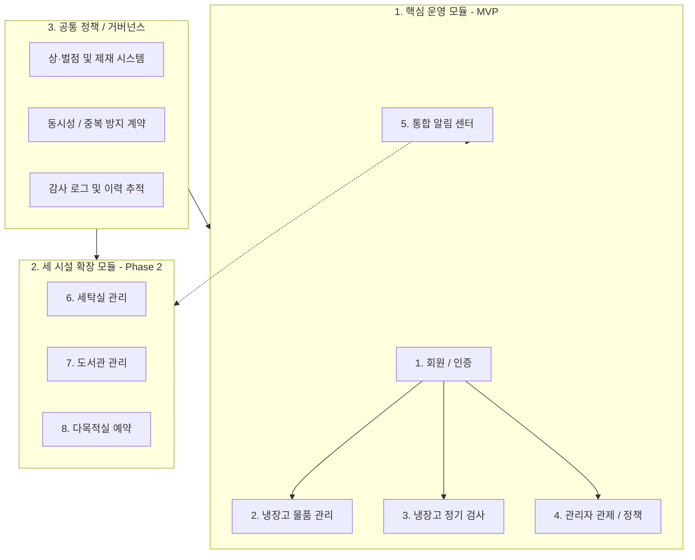

[Feature_Inventory.md](file:///Users/hyun/Documents/GitHub/DormMate/Feature_Inventory.md), [UI_Flow_Analysis.md](file:///Users/hyun/Documents/GitHub/DormMate/UI_Flow_Analysis.md), 정책 문서 및 현재 코드베이스를 종합 분석한 **DormMate 전체 기능 체계 정리**입니다.

---

# 📋 DormMate 전체 기능 체계도

DormMate는 기숙사 공동생활의 마찰을 줄이고 자원을 공정하게 분배하기 위해 **현재 핵심 서비스(냉장고 MVP)**와 **차기 확장 모듈(세탁실·도서관·다목적실)**로 구성되어 있습니다.

---

## 1. 핵심 운영 모듈 (MVP)

### 🔑 1) 회원 / 인증 시스템 (Auth) - 입사·퇴사 생애주기 관리
* **호실 기반 사전 발급 및 입사 배정**:
  * 공개 회원가입 대신 `호실(201~524)+개인번호(1~3)` 기반 슬롯을 사전 준비.
  * **입사 처리 (`POST /admin/residents/check-in`)**: 관리자가 입주자 정보(이름, 이메일)를 입력하여 계정을 활성화하고 초기 비밀번호(`0000`)를 안내.
* **최초 로그인 및 비밀번호 변경 강제 (`0000` 보호)**:
  * 초기 비밀번호(`0000`)로 로그인 성공 시 `mustChangePassword: true` 플래그가 포함된 임시 세션 발급.
  * **비밀번호 변경 전까지 시설 이용·개인정보 조회 전면 차단 (HTTP 403 `PASSWORD_CHANGE_REQUIRED`)**.
  * `POST /auth/change-password`로 본인만의 비밀번호를 설정해야 일반 정식 이용 가능.
* **비밀번호 분실 시 관리자 초기화**:
  * 관리자가 본인 확인 후 초기화(`POST /admin/residents/{id}/reset-password`) 실행.
  * 초기 비밀번호(`0000`)로 재설정, **기존 발급된 세션/토큰 전체 즉시 폐기**, 다음 로그인 시 비밀번호 변경 재요구.
* **퇴사 처리 및 계정 데이터 완전 격리**:
  * **퇴사 처리 (`POST /admin/residents/{id}/check-out`)**: 계정 비활성화(`CHECKED_OUT`), 세션 전체 즉시 폐기, 호실 배정 종료(`released_at`).
  * **💡 핵심 데이터 격리**: 다음 학기 새 입주자에게 같은 `205-1` 표시 아이디를 배정하더라도, **내부적으로는 완전히 새로운 User UUID를 발급**.
  * 이전 입주자의 물품·벌점·대출·알림 내역은 이전 UUID에 영구 보존되고, 새 입주자에게 100% 격리(누수 원천 차단).

---

### 🧊 2) 냉장고 물품 관리 (Inventory / Fridge)
* **호실-칸 접근 제어**:
  * 층별 호실 수와 냉장(3칸)·냉동(1칸) 비율에 따라 배정된 칸만 조회/등록 가능 (`GET /fridge/slots`).
* **포장(Bundle) 및 품목(Item) 등록 (장바구니형 CRUD)**:
  * 포장 1개당 3자리 고유 스티커 라벨(`001`~`999`) 자동 발급 (`bundle_label_sequence`).
  * 포장 내 다중 물품(품목명, 수량, 단위, 유통기한) 일괄 등록.
  * 칸별 허용량(`max_bundle_count`) 초과 시 `422 CAPACITY_EXCEEDED` 반환.
* **라벨 재사용 및 소프트 삭제**:
  * 포장 삭제 시 즉시 물리 삭제하지 않고 소프트 삭제 처리.
  * 삭제된 번호는 재사용 풀(`recycled_numbers`)로 회수되어 다음 포장 등록 시 우선 재발급.
* **조회 및 검색**:
  * 탭 필터: `전체`, `내 물품`, `임박(D-3 이하/노란 배지)`, `만료(D-0/빨간 배지)`.
  * 스티커 검색: “칸 선택 + 3자리 번호” 또는 품목/포장명 키워드 교차 검색.
* **프라이버시 보호**:
  * 포장 메모는 **작성자 본인에게만 노출** (타인 및 층별장 열람 시 마스킹 처리).

---

### 🔍 3) 냉장고 정기 검사 (Inspection)
* **검사 세션 및 동시성 잠금**:
  * 층별장/관리자가 본인 담당 층 칸을 대상으로 검사 세션 시작 (`POST /fridge/inspections`).
  * 세션 시작 시 해당 칸이 **잠금 상태(`lockedUntil`: 30분 TTL)**로 전환되어 입주자의 물품 등록/수정/삭제 차단 (`423 COMPARTMENT_LOCKED`).
  * 검사 활동 발생 시 30분 연장, 장시간 비활동 시 자동 해제.
* **조치 기록 (Action)**:
  * **통과 (`PASS`)**: 이상 없음.
  * **경고 (`WARN`)**: 보관 상태 불량, 정보 불일치.
  * **폐기 (`DISPOSE`)**: 유통기한 경과 등 (선택 시 즉시 **벌점 1점 자동 부과**).
  * **미등록 물품 폐기 (`UNREGISTERED_DISPOSE`)**: 라벨 없는 물품 즉시 등록 및 동시 폐기.
* **검사 제출 및 이력**:
  * 검사 전 탭의 모든 물품 조치가 완료되어야 최종 제출 가능.
  * 제출 완료 시 칸 잠금 해제 및 피검사자에게 조치 결과 일괄 알림 발송.
* **검사 후 수정 추적**:
  * 검사 완료 후 사용자가 수정한 물품을 별도 플래그(`updatedAfterInspection`)로 식별.

---

### 🛡️ 4) 관리자 관제 및 거버넌스 (Admin)
* **대시보드**: 전체 보관 물품 현황, 임박/만료 통계, 검사 진행률, 벌점 현황 집계.
* **역할 관리**: 일반 거주자 ➔ 층별장 승격/해제 즉시 반영 (`/admin/users/{id}/roles/floor-manager`).
* **냉장고 자원 관제**:
  * 칸 상태 수동 전환 (정상, 점검, 잠금, 퇴역).
  * 층별 칸 증설/축소에 따른 **호실 재배분 시뮬레이션 및 적용**.
  * 비정상 권한 불일치 물품(`vw_fridge_bundle_owner_mismatch`) 모니터링 및 강제 조치.
* **운영 정책 관리 (`/admin/policies`)**:
  * 임박 알림 배치 발송 시각(기본 09:00), 일일 발송 한도, 알림 TTL 설정.
  * 벌점 제재 기준(10점) 및 안내 문구 템플릿 관리.
* **보안 및 접근 제어**:
  * `/admin/**` 모든 엔드포인트는 `ADMIN` 역할 필수 (`401`/`403` 차단).
  * 초기 관리자 1회성 안전 부트스트랩 (`InitialAdminService`).

---

### 🔔 5) 통합 알림 유틸리티 (Notification)
* **배치 및 이벤트 알림**:
  * **매일 09:00 배치**: 유통기한 임박(D-3) 및 만료(D-day) 묶음 알림.
  * **실시간 이벤트**: 검사 결과(경고/폐기/벌점), 일정 등록/취소.
* **알림 피로 방지 및 중복 제거**:
  * 모듈별 하루 최대 발송 건수 2건 제한.
  * 중복 방지 키(`dedupe_key`) 및 TTL(기본 24시간 후 자동 만료) 적용.
  * 사용자별 알림 유형 ON/OFF 및 백그라운드 수신 토글 지원.
* **알림 센터 UI**: 미읽음 상단 정렬, 개별/전체 읽음 처리, 하단 네비게이션 탭 배지(`9+`).

---

## 2. 세 시설 확장 모듈 (Phase 2 - ver1 배포 스펙)
*상세 계약서: `docs/facility-contracts.md` / 의사결정 기록: `docs/design/architecture-decisions.md`*

### 🧺 6) 세탁실 관리 (Laundry)
* **기기 현황 (23대)**:
  * 남성 세탁실: 세탁기 6대 + 건조기 2대
  * 여성 세탁실: 세탁기 7대 + 건조기 6대
  * 남녀 공용: 이불 건조기 2대
* **사용 등록 및 진행 관리**:
  * 사용 가능(`AVAILABLE`) 기기 선택 후 작동 시작 ➔ `IN_USE` 전환.
  * 1인 동시 최대 2대 선점 제한 (원자적 조건부 갱신으로 동시성 보장).
  * **기종별 최근 사용 시간 기억 (UX 디테일)**: 세탁기/건조기/이불건조기 기종별로 직전에 설정했던 이용 시간이 기본값으로 자동 완성 (예: 1번 세탁기 45분 이용 후 다음날 4번 세탁기 선택 시 45분 자동 추천).
  * **종료 5분 전 자동 알림**: 개별 타이머 설정 없이 시스템이 `종료 5분 전` 수거 준비 인앱 알림 자동 발송.
* **세탁물 수거 알림 (핵심 인터랙션)**:
  * 다음 사용자가 완료된 세탁물을 바구니로 옮겨 담은 후 전송하는 배려 알림.
  * **최대 30자 메모 입력 가능** (예: `"3층 핑크색 바구니에 넣어뒀어요"`). 미입력 시 표준 문구 전송.
  * **발신자 호실('205호') 표기**: 장난 알림 방지 및 책임감 부여, 개인 프라이버시 보호(이름/개인번호 비노출).
* *(백로그: 10분 경과 방치 알림 자동화는 ver2, 남은 시간 ±10분 정정은 ver3로 분리)*

---

### 📚 7) 도서관 관리 (Library)
* **도서 검색 및 대출/반납**:
  * 도서 카탈로그 검색 (도서명, 저자, 도서번호).
  * 기본 대출 14일 (1인 최대 3권), 1회 한정 연장(+7일, 예약자 없을 시).
* **경량 공정 대기열 (1인 제한)**:
  * 도서 1권당 **예약 대기열 최대 1명 제한** (`UNIQUE(book_id, status)`).
  * 반납 시 예약자에게 5일간 우선 대출 보장.
* **연체 관리**:
  * 반납 5일 전 / 당일 09:00 안내 알림.
  * 연체 시 매일 09:00 독촉 알림 및 **1일당 1벌점 자동 부과**.

---

### 🏢 8) 다목적실/스터디룸 예약 (Study Room)
* **시설 구성**: 3개 다목적실 (Room A, B, C).
* **타임라인 예약 프로세스**:
  * 주간 타임라인(오늘 ~ 차주 일요일) 기준 **10분 단위** 예약 (최소 30분 ~ 최대 3시간).
  * **실제 이용 인원 수(`attendeeCount`) 필수 기록**.
* **💡 독점 방지: 투명한 달력 UI를 통한 소셜 프레셔 (사회적 억제)**:
  * 복잡한 주당 시간 쿼터나 알고리즘 대신, **달력 UI를 넘겼을 때 과거/현재 예약자의 호실('205호')과 이용 시간이 투명하게 공개**되어 공동체 평판에 의해 자발적 독점 자제 유도.
* *(백로그: '같이 이용'(구 합석) 및 실시간 인원 변경은 ver2, 노쇼 판정 큐는 ver2로 분리)*

---

## 3. 공통 거버넌스 및 시스템 정책

| 정책 영역 | 핵심 규칙 |
| :--- | :--- |
| **역할 권한 (RBAC)** | • `RESIDENT`: 본인 칸/물품 등록·관리, 시설 예약·대출, 본인 세션 관리 • `FLOOR_MANAGER`: 거주자 권한 + 담당 층 냉장고 칸 잠금 검사 및 조치 기록 • `ADMIN`: 전역 접근, 역할 임명/해제, 시설 강제조치, 정책 튜닝, 감사 로그 |
| **벌점 및 이용 제재** | • **자동 부과**: 냉장고 폐기(1점), 도서관 연체(1일 1점) • **🚨 핵심 제재**: **누적 벌점 10점 이상 시 세탁실·도서관·다목적실 신규 이용/예약 자동 전면 차단 (`403 FACILITY_ACCESS_SUSPENDED_BY_PENALTY`)** (단, 기본 식생활인 냉장고는 제재 대상에서 제외) |
| **동시성 및 중복 방지** | • **냉장고**: 칸별 라벨 시퀀스 락, 검사 세션 진행 중 타 사용자 수정 차단 (423) • **세탁실**: 동일 기기 동시 사용 차단 (`AVAILABLE` 조건부 원자적 갱신), 1인 동시 2대 초과 선점 차단 • **도서관**: 도서 1권 동시 대출 불가, 예약 대기열 1명 초과 등록 차단 (DB Unique 제약) • **다목적실**: 동일 룸 시간대 중복 차단 (`tstzrange` Exclusion Constraint), 1인 동시간 다중 룸 예약 차단 |
| **감사 로그 (Audit Log)** | • 검사 제출/정정, 벌점 부과/취소, 시설 강제 예약/차단, 입·퇴사 슬롯 배정 등 모든 관리자 행위 영구 기록 (`audit_log`) |