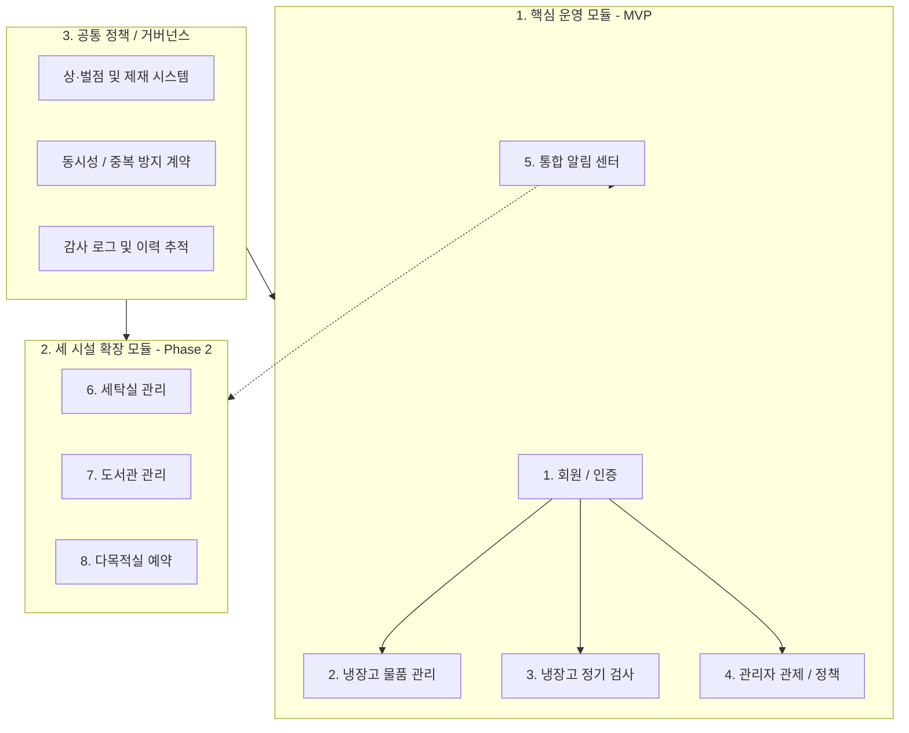

[Feature_Inventory.md](file:///Users/hyun/Documents/GitHub/DormMate/Feature_Inventory.md), [UI_Flow_Analysis.md](file:///Users/hyun/Documents/GitHub/DormMate/UI_Flow_Analysis.md), 정책 문서 및 현재 코드베이스를 종합 분석한 **DormMate 전체 기능 체계 정리**입니다.

---

# 📋 DormMate 전체 기능 체계도

DormMate는 기숙사 공동생활의 마찰을 줄이고 자원을 공정하게 분배하기 위해 **현재 핵심 서비스(냉장고 MVP)**와 **차기 확장 모듈(세탁실·도서관·다목적실)**로 구성되어 있습니다.

---

## 1. 핵심 운영 모듈 (MVP)

### 🔑 1) 회원 / 인증 시스템 (Auth)
* **회원가입 및 호실 배정**:
  * 호실(2~5층, 총 96개 호실) + 개인번호(1~3번) 조합으로 가입 신청 (`signup_request`).
  * 관리자 승인 전 대기(`PENDING`) ➔ 승인 후 활성화(`ACTIVE`).
* **로그인 및 세션 관리**:
  * 아이디(대소문자 무구분 식별) / 비밀번호 인증 (`POST /auth/login`).
  * **디바이스 식별(`deviceId`) 기반 세션 관리**: 기기 불일치 시 `DEVICE_MISMATCH` 즉시 세션 폐기.
  * 리프레시 토큰 Rotation 및 SHA-256 해시 저장 (7일 TTL).
  * 비밀번호 변경 및 탈퇴 시 기존 모든 발급 세션 일괄 무효화.
* **계정 상태 및 탈퇴**:
  * 탈퇴 시 즉시 비활성화(`INACTIVE`) 처리하여 로그인 차단하되, 과거 보관/검사 이력은 무결성 보존.

---

### 🧊 2) 냉장고 물품 관리 (Inventory / Fridge)
* **호실-칸 접근 제어**:
  * 층별 호실 수와 냉장(3칸)·냉동(1칸) 비율에 따라 배정된 칸만 조회/등록 가능 (`GET /fridge/slots`).
* **포장(Bundle) 및 품목(Item) 등록 (장바구니형 CRUD)**:
  * 포장 1개당 3자리 고유 스티커 라벨(`001`~`999`) 자동 발급 (`bundle_label_sequence`).
  * 포장 내 다중 물품(품목명, 수량, 단위, 유통기한) 일괄 등록.
  * 칸별 허용량(`max_bundle_count`) 초과 시 `422 CAPACITY_EXCEEDED` 반환.
* **라벨 재사용 및 소프트 삭제**:
  * 포장 삭제 시 즉시 물리 삭제하지 않고 소프트 삭제 처리.
  * 삭제된 번호는 재사용 풀(`recycled_numbers`)로 회수되어 다음 포장 등록 시 우선 재발급.
* **조회 및 검색**:
  * 탭 필터: `전체`, `내 물품`, `임박(D-3 이하/노란 배지)`, `만료(D-0/빨간 배지)`.
  * 스티커 검색: “칸 선택 + 3자리 번호” 또는 품목/포장명 키워드 교차 검색.
* **프라이버시 보호**:
  * 포장 메모는 **작성자 본인에게만 노출** (타인 및 층별장 열람 시 마스킹 처리).

---

### 🔍 3) 냉장고 정기 검사 (Inspection)
* **검사 세션 및 동시성 잠금**:
  * 층별장/관리자가 본인 담당 층 칸을 대상으로 검사 세션 시작 (`POST /fridge/inspections`).
  * 세션 시작 시 해당 칸이 **잠금 상태(`lockedUntil`: 30분 TTL)**로 전환되어 입주자의 물품 등록/수정/삭제 차단 (`423 COMPARTMENT_LOCKED`).
  * 검사 활동 발생 시 30분 연장, 장시간 비활동 시 자동 해제.
* **조치 기록 (Action)**:
  * **통과 (`PASS`)**: 이상 없음.
  * **경고 (`WARN`)**: 보관 상태 불량, 정보 불일치.
  * **폐기 (`DISPOSE`)**: 유통기한 경과 등 (선택 시 즉시 **벌점 1점 자동 부과**).
  * **미등록 물품 폐기 (`UNREGISTERED_DISPOSE`)**: 라벨 없는 물품 즉시 등록 및 동시 폐기.
* **검사 제출 및 이력**:
  * 검사 전 탭의 모든 물품 조치가 완료되어야 최종 제출 가능.
  * 제출 완료 시 칸 잠금 해제 및 피검사자에게 조치 결과 일괄 알림 발송.
* **검사 후 수정 추적**:
  * 검사 완료 후 사용자가 수정한 물품을 별도 플래그(`updatedAfterInspection`)로 식별.

---

### 🛡️ 4) 관리자 관제 및 거버넌스 (Admin)
* **대시보드**: 전체 보관 물품 현황, 임박/만료 통계, 검사 진행률, 벌점 현황 집계.
* **역할 관리**: 일반 거주자 ➔ 층별장 승격/해제 즉시 반영 (`/admin/users/{id}/roles/floor-manager`).
* **냉장고 자원 관제**:
  * 칸 상태 수동 전환 (정상, 점검, 잠금, 퇴역).
  * 층별 칸 증설/축소에 따른 **호실 재배분 시뮬레이션 및 적용**.
  * 비정상 권한 불일치 물품(`vw_fridge_bundle_owner_mismatch`) 모니터링 및 강제 조치.
* **운영 정책 관리 (`/admin/policies`)**:
  * 임박 알림 배치 발송 시각(기본 09:00), 일일 발송 한도, 알림 TTL 설정.
  * 벌점 제재 기준(10점) 및 안내 문구 템플릿 관리.
* **보안 및 접근 제어**:
  * `/admin/**` 모든 엔드포인트는 `ADMIN` 역할 필수 (`401`/`403` 차단).
  * 초기 관리자 1회성 안전 부트스트랩 (`InitialAdminService`).

---

### 🔔 5) 통합 알림 유틸리티 (Notification)
* **배치 및 이벤트 알림**:
  * **매일 09:00 배치**: 유통기한 임박(D-3) 및 만료(D-day) 묶음 알림.
  * **실시간 이벤트**: 검사 결과(경고/폐기/벌점), 일정 등록/취소.
* **알림 피로 방지 및 중복 제거**:
  * 모듈별 하루 최대 발송 건수 2건 제한.
  * 중복 방지 키(`dedupe_key`) 및 TTL(기본 24시간 후 자동 만료) 적용.
  * 사용자별 알림 유형 ON/OFF 및 백그라운드 수신 토글 지원.
* **알림 센터 UI**: 미읽음 상단 정렬, 개별/전체 읽음 처리, 하단 네비게이션 탭 배지(`9+`).

---

## 2. 세 시설 확장 모듈 (Phase 2 - 차기 확장)

현재 UI에서는 `ComingSoonCard`로 준비 중이며, DB·API·권한·중복 방지 계약을 통해 확장됩니다.

### 🧺 6) 세탁실 관리 (Laundry)
* **기기 현황**:
  * 남성 세탁실: 세탁기 6대 + 건조기 2대
  * 여성 세탁실: 세탁기 7대 + 건조기 6대
  * 남녀 공용: 이불 건조기 2대 (총 23대 기기)
* **사용 등록 및 진행 관리**:
  * 사용 가능(`AVAILABLE`) 기기 선택 후 작동 시간(세탁 38분, 건조 50분) 등록 ➔ `IN_USE` 전환.
  * 1분/10분 단위 시간 증감 및 개인 프리셋 저장.
* **협업 및 타인 기기 상호작용**:
  * **남은 시간 오차 정정**: ±10분 범위 내에서 타인 기기 종료 시간 정정 (원사용자에게 알림 발송).
  * **수거 요청 메시지**: 완료 후 5분 미수거 시 "기다리고 있어요" 알림 1회 전송.
  * **강제 사용 전환**: 미수거 방치 세탁물 정리 후 "세탁물 빼놨어요" 버튼으로 강제 사용 가능 전환.
  * **미등록 사용 간편 등록**: 시스템 미등록 작동 기기 발견 시 간편 등록.
* **고장 신고 및 관리**:
  * 일반 사용자 고장 신고 ➔ 즉시 기기 임시 차단 ➔ 관리자 확인 후 정식 고장(`MAINTENANCE`) 전환.

---

### 📚 7) 도서관 관리 (Library)
* **도서 검색 및 원스톱 팝업**:
  * 도서명, 저자, ISBN, 도서번호 검색 (신규/인기 탭 제공).
  * 상세 팝업에서 대출/반납/연장/예약 원스톱 처리.
* **대출 및 반납 정책**:
  * 기본 대출 기간 14일 (1인 최대 권수 제한).
  * 연장: 반납 예정일 전 **1회 한정 +7일** (예약자가 없을 때만 허용).
  * 반납 완료 시 대기 중인 예약자에게 대출 가능 알림 즉시 발송.
* **예약 대기열 규칙 (경량 공정성)**:
  * **예약 대기열은 도서 1권당 최대 1명만 허용** (복잡한 큐 방지 및 공정성 확보).
  * 반납 후 **5일간** 예약자 우선 대출 권한 부여 (미대출 시 예약 자동 취소).
* **연체 및 벌점**:
  * 반납 5일 전 / 당일 09:00 안내 알림.
  * 연체 시 매일 09:00 독촉 알림 및 **1일당 1벌점 자동 부과**.

---

### 🏢 8) 다목적실/스터디룸 예약 (Study Room)
* **시설 구성**: 3개 다목적실 (Room A, B, C).
* **타임라인 예약 프로세스**:
  * 주간 타임라인(오늘 ~ 차주 일요일) 기준 **10분 단위** 예약.
  * 예약 시간: 최소 30분 ~ 최대 3시간.
  * **합석 허용(Co-use) 옵션**: 합석 허용 시 타 사용자 예약 허용, 비허용 시 해당 시간대 단독 배타 선점.
* **예약 취소 및 노쇼(No-Show) 처리**:
  * 시작 1시간 전까지 무료 취소 가능.
  * **시작 1시간 이내 급작스러운 취소 시 벌점 1점 부과**.
  * 원클릭 노쇼/미등록 신고 ➔ 관리자 검토 큐 적재 ➔ 확인 후 **벌점 2점 수동 부과**.
* **관리자 강제 통제**:
  * 시설 점검, 기숙사 행사 목적의 강제 예약(일반 예약 차단) 및 예약 강제 취소.

---

## 3. 공통 거버넌스 및 시스템 정책

| 정책 영역 | 핵심 규칙 |
| :--- | :--- |
| **역할 권한 (RBAC)** | • `RESIDENT`: 본인 칸/물품 등록·관리, 시설 예약·대출, 본인 세션 관리 • `FLOOR_MANAGER`: 거주자 권한 + 담당 층 냉장고 칸 잠금 검사 및 조치 기록 • `ADMIN`: 전역 접근, 역할 임명/해제, 시설 강제조치, 정책 튜닝, 감사 로그 |
| **벌점 및 이용 제재** | • **자동 부과**: 냉장고 폐기(1점), 도서관 연체(1일 1점), 다목적실 1시간 내 취소(1점) • **수동 부과**: 다목적실 노쇼(2점), 세탁물 장기 방치(1점) • **🚨 핵심 제재**: **누적 벌점 10점 이상 시 세탁실·도서관·다목적실 1주일 이용 자동 제한** (단, 기본 식생활인 냉장고는 제재 대상에서 제외) |
| **중복 방지 (Concurrency)** | • **냉장고**: 칸별 라벨 시퀀스 락, 검사 세션 진행 중 타 사용자 수정 차단 (423) • **세탁실**: 동일 기기 동시 사용 차단 (`AVAILABLE` 조건부 원자적 갱신), 1인 동시 2기기 초과 선점 제한 • **도서관**: 도서 1권 동시 대출 불가, 예약 대기열 1명 초과 등록 차단 (DB Unique 제약) • **다목적실**: 비합석 예약의 동일 룸 시간대 중복 차단 (시간 범위 겹침 검증/Exclusion Constraint), 1인 동일 시간대 중복 예약 불가 |
| **감사 로그 (Audit Log)** | • 검사 제출/정정, 벌점 부과/취소, 강제 예약/취소, 역할 승격/강등, 계정 비활성화 등 모든 관리자/민감 행위 영구 기록 (`audit_log`) |